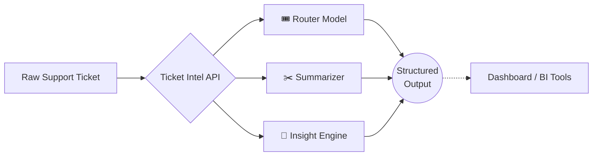

<div align="center">
  
# 🎫 Ticket Intel

**Advanced NLP System for Support Ticket Intelligence**

[](https://www.python.org/)
[](https://fastapi.tiangolo.com/)
[](https://streamlit.io/)
[](https://opensource.org/licenses/MIT)

*Intelligent Routing • Extractive Summarization • Insight Extraction*

[**Explore the Docs**](https://CCallahan308.github.io/ticket-intel) · [**Report Bug**](https://github.com/CCallahan308/ticket-intel/issues) · [**Request Feature**](https://github.com/CCallahan308/ticket-intel/issues)

</div>

---

## ⚡ What it Does

Turn chaotic, unstructured customer support queues into organized, actionable data streams. **Ticket Intel** is a production-ready NLP backend and visualization dashboard that significantly decreases ticket handling time.

- **🔀 Smart Routing** - Classifies tickets into operational categories in milliseconds using an optimized TF-IDF + Naive Bayes pipeline (abstracted for simple Transformer model drop-ins).
- **✂️ Auto-Summarization** - Distills long, rambling support threads into concise, extractive summaries using TF-IDF word frequency scoring.
- **🔍 Deep Insights** - Instantly surfaces Named Entities, Keywords, and Customer Sentiment before an agent even opens the ticket.
- **🔌 Interactive API** - Lightning-fast FastAPI backend bringing the NLP models to life, fully documented with OpenAPI/Swagger.
- **📊 Analytics Dashboard** - A sleek Streamlit UI for monitoring trends, processing single tickets, or running batch evaluations.

---

## 🏗️ Architecture Design



## 🚀 Quick Start

Ensure you have downloaded the [Kaggle Customer Support Ticket Dataset](https://www.kaggle.com/datasets/waseemalastal/customer-support-ticket-dataset) and saved it as `tickets.csv` in the project root.

### Local Development Environment

```bash
# Clone the repository
git clone https://github.com/CCallahan308/ticket-intel.git
cd ticket-intel

# Set up and activate virtual environment
python -m venv venv
source venv/bin/activate  # On Windows use: venv\Scripts\activate

# Install requirements
pip install -r requirements.txt
```

### Running the Services

- **Start the Insight API** (Interactive docs at `http://localhost:8000/docs`)

  ```bash
  python main.py api
  ```

- **Start the Streamlit Dashboard**

  ```bash
  python main.py ui
  ```

### 🐳 Docker Deployment

Ticket Intel includes highly optimized, production-ready Dockerfiles.

```bash
# 1. Start the API Container
docker build -t ticket-intel-api -f Dockerfile.api .
docker run -p 8000:8000 ticket-intel-api

# 2. Start the Dashboard Container
docker build -t ticket-intel-ui -f Dockerfile.ui .
docker run -p 8501:8501 ticket-intel-ui
```

---

## 📚 Comprehensive Documentation

For detailed guides, architecture deep-dives, and contribution guidelines, visit our **[GitHub Pages Documentation Site](https://CCallahan308.github.io/ticket-intel)**.

## 🛡️ License

This project is licensed under the MIT License - see the [LICENSE](LICENSE) file for details.
