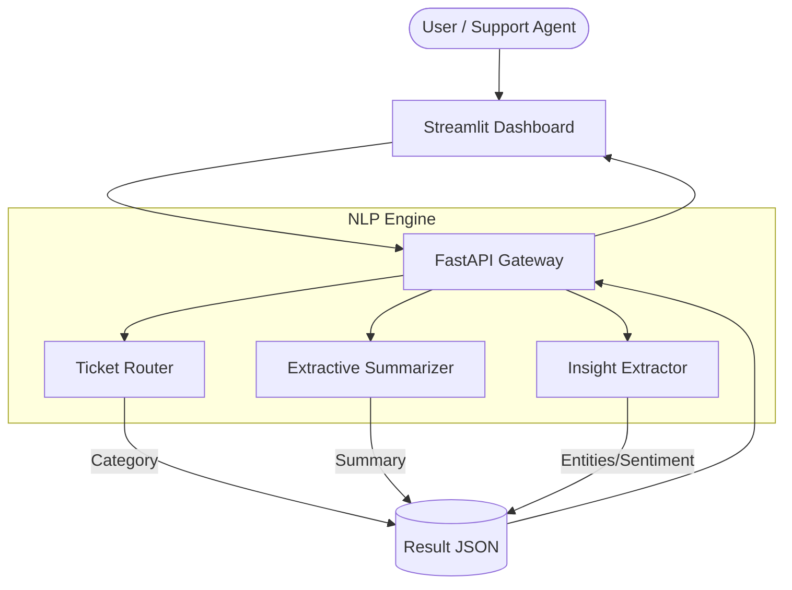

# Architecture & Design

Ticket Intel is engineered to be modular, extensible, and scalable. This section details the internal workings of the NLP pipelines and system architecture.

---

## 🔀 System Pipeline

The core value of Ticket Intel lies in its three primary ML models, wrapped by a fast API and a solid frontend.



---

## 🧠 Model Breakdown

### 1. Ticket Router

Currently implemented using a classic pipeline: **TF-IDF Vectorization** combined with a **Naive Bayes Classifier**.
*Why?* It's incredibly fast to train, highly interpretable, and provides an excellent baseline model. The architecture is modularized, meaning it can be effortlessly swapped out for a Transformer-based model (e.g., BERT or RoBERTa) in the future.

### 2. Extractive Summarizer

Extracts the most critical sentences from a support ticket rather than generating text from scratch. It uses word frequency scoring to weigh sentences.
*Why?* Extractive summarization is computationally lighter than abstractive summarization (like GPT), and operates without the risk of "hallucinations" - crucial in a customer support context where factuality is mandatory.

### 3. Insight Extractor

Utilizes lightweight NLP heuristics and dictionaries to perform:

- **Named Entity Recognition (NER)** (simplified) to find organizations or ticket references.
- **Sentiment Analysis** to gauge if a customer is frustrated or satisfied based on keyword polarity.
- **Keyword Extraction** to pull out the most important topics rapidly.

---

## 📂 Project Structure

```text
ticket-intel/
├── .github/workflows/ # (CI/CD: GitHub Pages deployment)
├── docs/              # MkDocs material documentation source
├── notebooks/         # Exploratory Data Analysis & Prototyping
├── src/
│   ├── api/           # FastAPI application, CORS, routers
│   ├── data/          # Data loading and preprocessing logic
│   ├── models/        # The ML components defined above
│   ├── ui/            # Streamlit dashboard implementation
│   └── utils/         # Shared utilities (text cleaning, NLP ops)
├── tests/             # Full Pytest suite
├── main.py            # Elegant CLI entrypoint using argparse
└── Dockerfile.*       # Containerizations configurations
```
